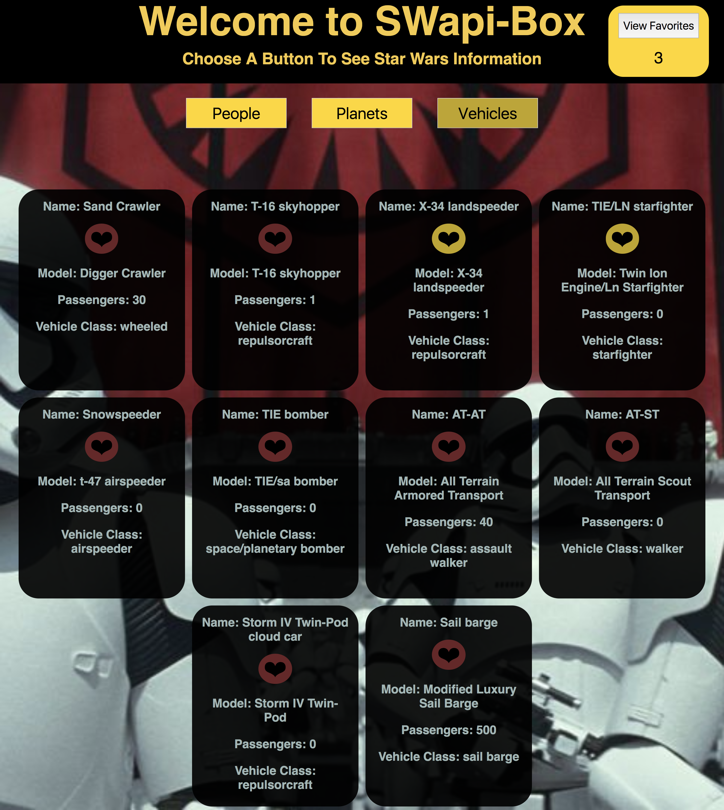

This project was bootstrapped with [Create React App](https://github.com/facebookincubator/create-react-app).

# SWAPIbox
## Individual: Sabrina Kennedy,

## Description

This was an individual project to make a Star Wars facts application. A user can come to the page and get information about the people, vehicles, and planets of the Star Wars universe. Each card has a favorites button, that when clicked, will add that card to favorites which can be viewed on a seperate page. Data comes from the Star Wars API:https://swapi.co/documentation.

## Goals of Project:

1)Get comfortable whipping together React components on your own with the additional complexity of implementing React Router (if you want to).
2)Write squeaky clean, well refactored code using ES6 syntax.
3)Make informed design decisions to create a user-friendly application.
4)Keep state based components to a minimum and leverage more functional components.
5)Use a modular architecture for your application file structure.
6)Think deeply about React Lifecycle Methods.
7)Use propTypes for every component receiving props.

## Set Up

Clone this project

Run `npm install` from the root directory

Run `npm start`

You can run the testing suite with `npm test`.

## Future

I would like to add more star Wars data in the furture, with pulling in starship information or allowing the user to see more data that comes from the api.

## Screenshot

